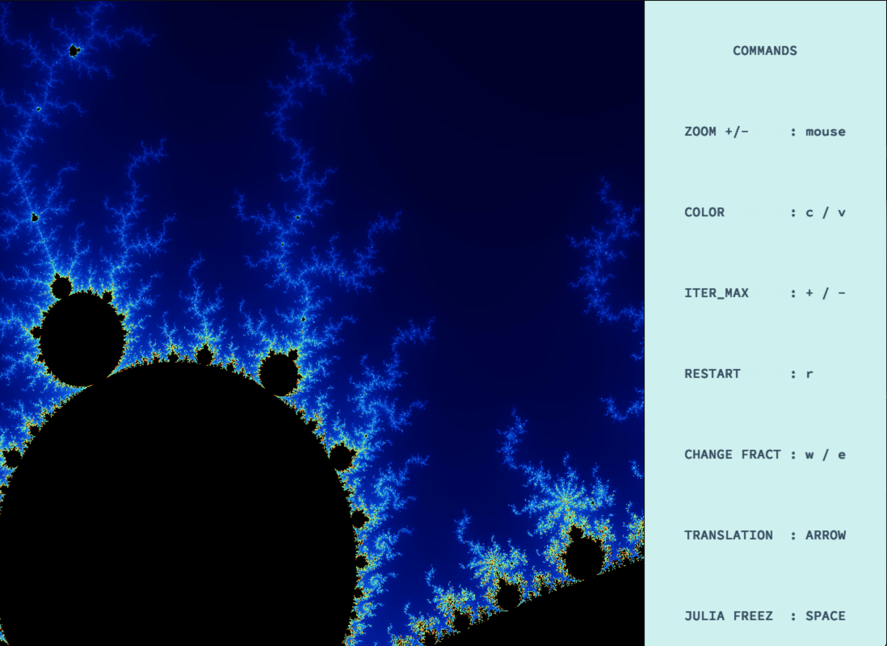
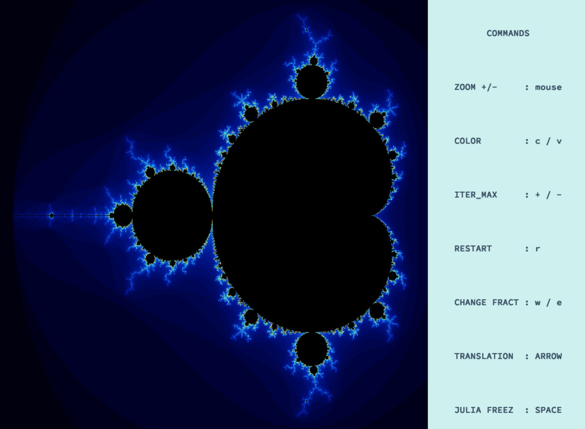
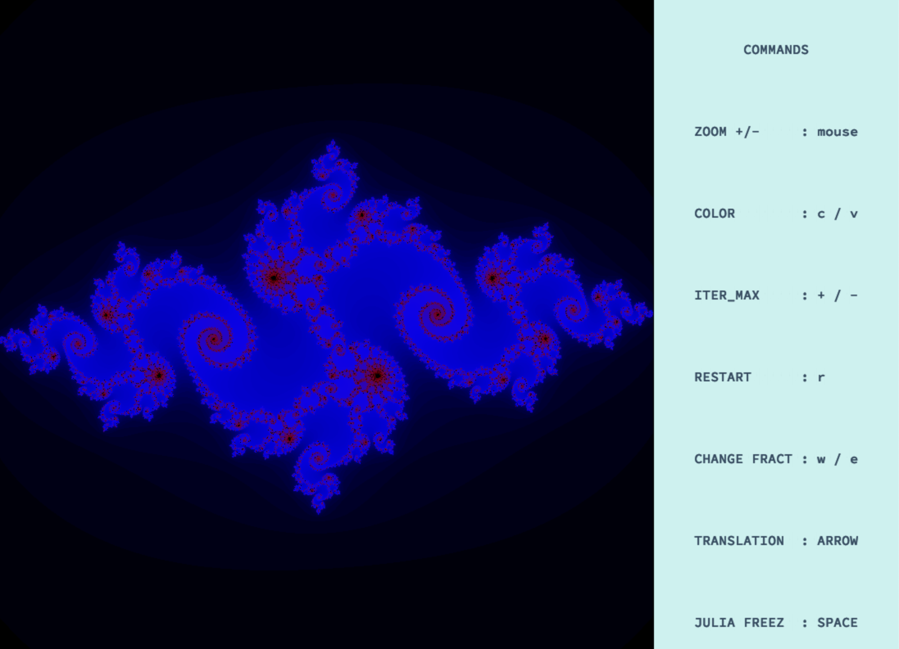
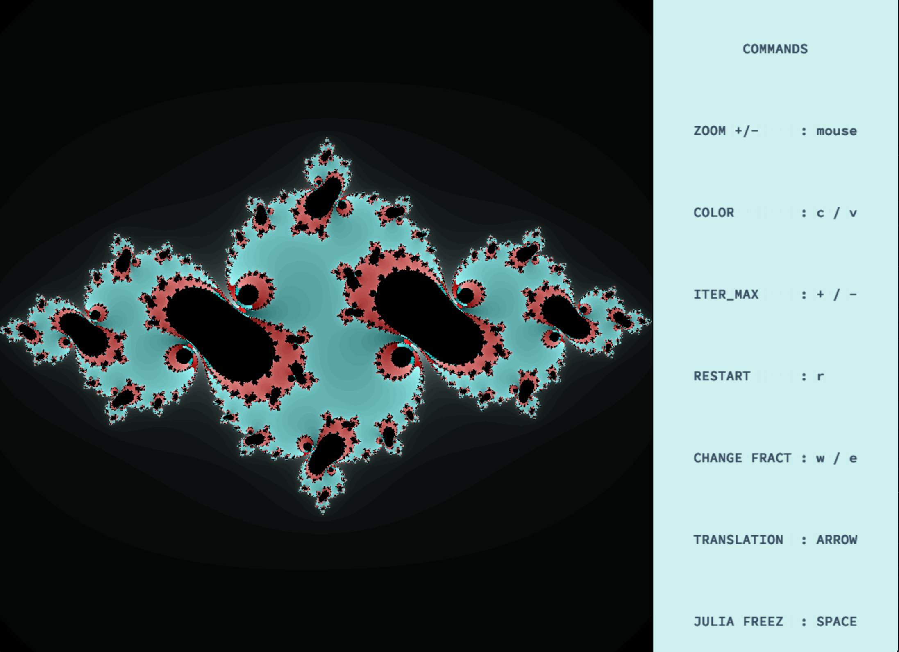
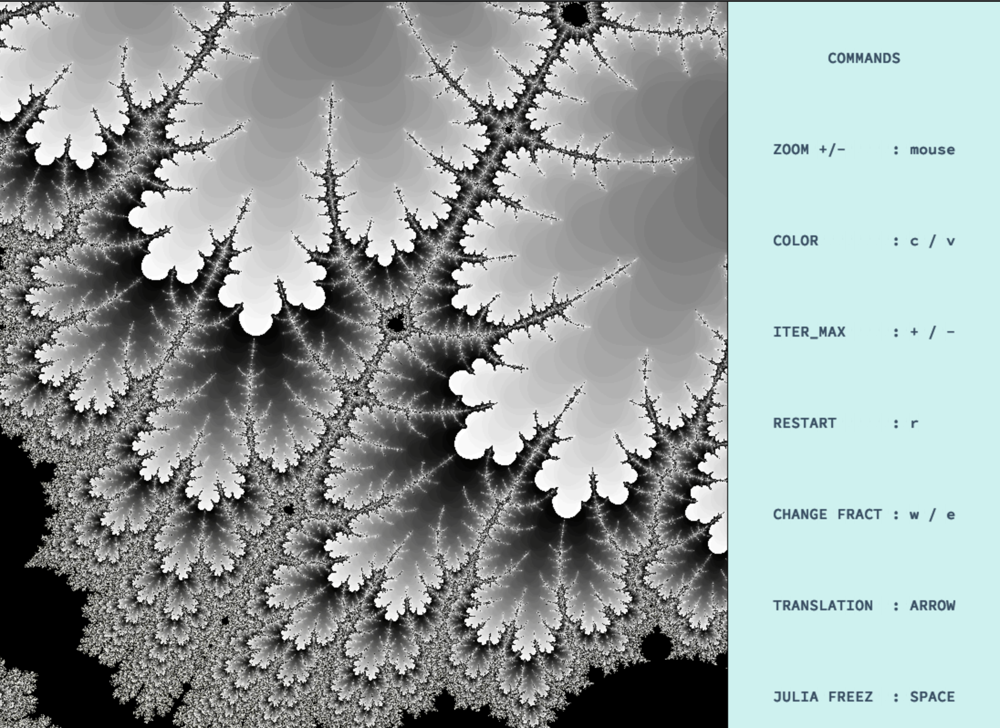

# fractol
Fractol is a graphic program that render amazing fractals ,developed for my learning course at 42 school for the exploration of Fractals.

* Zoom and unzoom
* Change the number of iterations
* Move the current fractal
* Change the display color and gradient
* Navigate between the fractals
* Edit the shape of the fractal with the position of the mouse (only available with the fractal Julia,feigenbaum-point ,burning_julia)

## Install & launch
```bash
git clone https://github.com/aeddaqqa/Fract_ol-42 ~/fractol
cd ~/fractol && ./fractol mandelbrot
```
You have to launch the program with a parameter. This is the name of the fractal you would like to open at the execution of the program. This parameter as to be the name of a valid fractal (Julia, Mandelbrot, Burning-julia, Feigenbaum, Teardrop or Tricorn).<br />

## Keyboard shortcuts

<table width="100%">
<thead>
<tr>
<td width="65%" height="60px" align="center" cellpadding="0">
<strong>Description</strong>
</td>
<td width="10%" align="center" cellpadding="0">
<span style="width:70px">&nbsp;</span><strong>Key(s)</strong><span style="width:50px">&nbsp;</span>
</td>
</tr>
</thead>
<tbody>
<tr>
<td valign="top" height="30px">Close the program</td>
<td valign="top" align="center"><kbd>&nbsp;esc&nbsp;</kbd></td>
</tr>
<tr>
<td valign="top" height="30px">Change the map</td>
<td valign="top" align="center"><kbd>&nbsp;w /e&nbsp;</kbd></td>
</tr>
<tr>
<td valign="top" height="30px">Move the fractal to the up</td>
<td valign="top" align="center"><kbd>&nbsp;▲&nbsp;</kbd></td>
</tr>
<tr>
<td valign="top" height="30px">Move the fractal to the down</td>
<td valign="top" align="center"><kbd>&nbsp;▼&nbsp;</kbd></td>
</tr>
<tr>
<td valign="top" height="30px">Move the fractal to the left</td>
<td valign="top" align="center"><kbd>&nbsp;◄&nbsp;</kbd></td>
</tr>
<tr>
<td valign="top" height="30px">Move the fractal to the right</td>
<td valign="top" align="center"><kbd>&nbsp;►&nbsp;</kbd></td>
</tr>
<tr>
<td valign="top" height="30px">Increase the number of iterations</td>
<td valign="top" align="center"><kbd>&nbsp;+&nbsp;</kbd></td>
</tr>
<tr>
<td valign="top" height="30px">Decrease the number of iterations</td>
<td valign="top" align="center"><kbd>&nbsp;-&nbsp;</kbd></td>
</tr>
<tr>
  <td valign="top" height="30px">coloration methode changing</td>
<td valign="top" align="center"><kbd>&nbsp;c&nbsp;</kdb></td>
</tr>
<td valign="top" height="30px">Color changing</td>
<td valign="top" align="center"><kbd>&nbsp;v&nbsp;</kdb></td>
</tr>
<tr>
<td valign="top" height="30px">Freez Julia</td>
<td valign="top" align="center"><kbd>&nbsp;space&nbsp;</kbd></td>
</tr>
</tbody>
</table>

## Mouse controls

<table width="100%">
<thead>
<tr>
<td width="60%" height="60px" align="center" cellpadding="0">
<strong>Description</strong>
</td>
<td width="10%" align="center" cellpadding="0">
<span style="width:70px">&nbsp;</span><strong>Control(s)</strong><span style="width:50px">&nbsp;</span>
</td>
</tr>
</thead>
<tbody>
<td valign="top" height="30px">Zoom</td>
<td valign="top" align="center"><kbd>&nbsp;scroll up&nbsp;</kbd></td>
</tr>
<tr>
<td valign="top" height="30px">Unzoom</td>
<td valign="top" align="center"><kbd>&nbsp;scroll down&nbsp;</kbd></td>
</tr>
</tbody>
</table>

Example :







